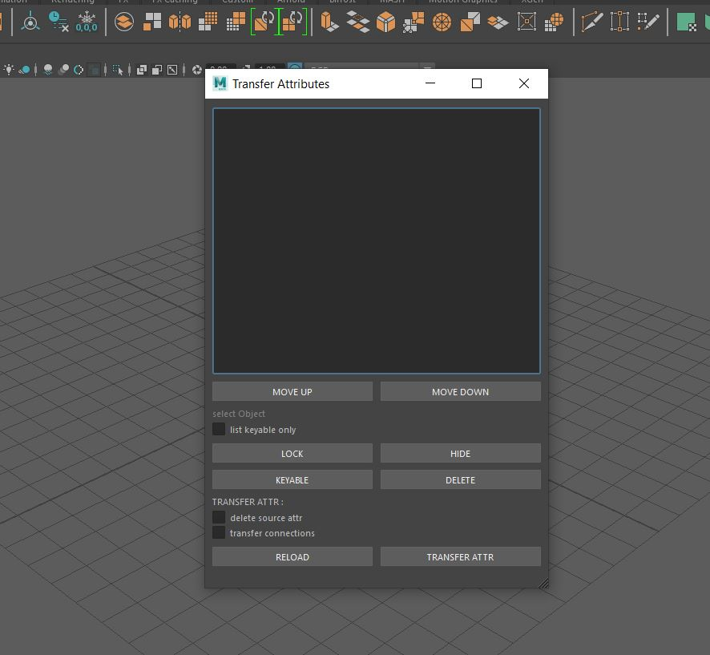

# HOW TO USE
1. clone the repository or copy the required script module to maya script folder
eg. "Documents\maya\2020\scripts"
2. Type the following code into the maya script editors python tab and run to access the tool
    ```python
    import transfer_Attr
    reload(transfer_Attr)
    transfer_Attr.core.UI() 
    ```
    for repeated use you could add the above snippet as a shelf icon
    
3. A simple tool demo can be found here

    [](http://www.youtube.com/watch?v=i5xlmWOz4wg)
    
4. If all goes correctly you should get the tool a screen shot is given below


    
